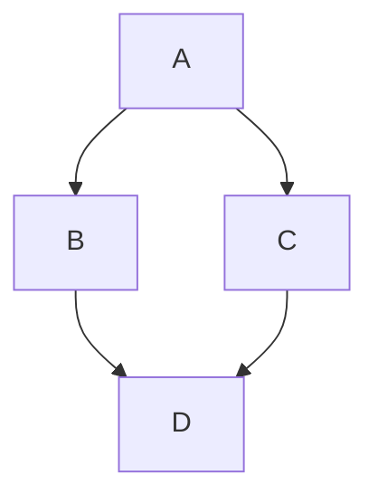

# Title

## SubTitle

__content__

## サブタイトル

[A link to GitHub](http://github.com/)

This is `$E = mc^2$` inline math.

This first math `$x^2$` in this line will render. This one `$z^3$` should as well.

Also within parentheses (`$x^2$`) and (`$z^3$`).



### Lists

* item one
* item two
  * nested a
  * nested b
* item three

1. first
2. second
3. third

### Code and Inline

Here is `inline code` in a sentence.

```python
def hello():
    print("world")
```

### Image


### Block Quote

> This is a quoted paragraph.

### Table

col1 | col2
--- | ---
a | b
c | d

### Horizontal Rule

---

### Footnote

This has a footnote[^1].

[^1]: The footnote text.
